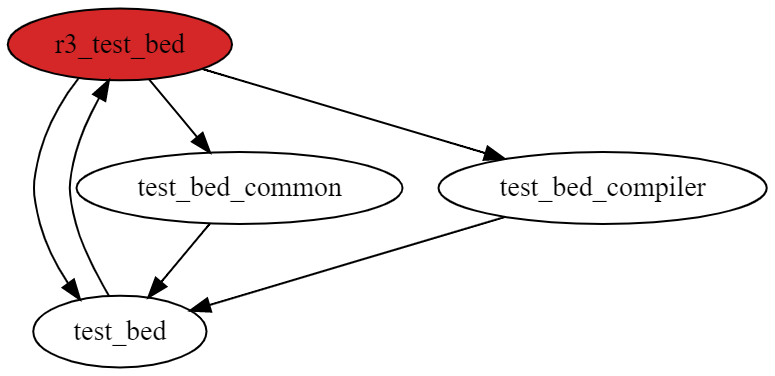

### ts-circular-dependencies

This tool requires a test configuration that declares a set of source files which
should be checked for cyclic dependencies. e.g.

```
yarn ts-circular-deps --config ./test-config.js <check|approve>
```

### Limitations

In order to detect cycles, the tool currently visits each source file and runs
depth first search. If the DFS comes across any node that is part of the current
DFS path, then a cycle has been detected and the tool will capture it.

This algorithm has limitations. For example, consider the following graph:



Depending on which source file is considered first, the output of the circular dependency tool
will be different. This is because the tool does not recursively find _all_ possible cycles. This
would be too inefficient for large graphs (especially in the `angular/angular` repository).

In this concrete example, the tool will visit `r3_test_bed` first. Then the first neighbour
(based on the import in the source file) will be visited. This is `test_bed`. Once done, the
tool will visit the first neighbour of `test_bed`. This is `r3_test_bed` again. The node has
already been visited, and also is part of the current DFS path. The tool captures this as cycle.

As no more nodes can be visited within that path, the tool continues (as per DFS algorithm)
with visiting the remaining neighbours of `r3_test_bed`. It will visit `test_bed_common` and
then come across `test_bed`. The tool only knows that `test_bed` has already been visited, but
it does not know that it would close a cycle. The tool certainly could know this by recursively
checking neighbours of `test_bed` again, but this is inefficient and will cause the algorithm
to eventually degenerate into brute-force.

In summary, the tool is unable to capture _all_ elementary cycles in the graph. This does not
mean though that the tool is incorrectly suggesting that there are _no_ cycles in a graph. The
tool is still able to correctly detect whether there are _any_ cycles in a graph or not. For
example, if edge from `r3_test_bed` to `test_bed` is removed, then the tool will be able to
capture at least one of the other cycles. The golden will change in an unexpected way, but it's
**expected** given the trade-off we take for an acceptable running time.

Other algorithms exist which are proven to print out _all_ the elementary cycles in a directed
graph. For example:

- [Johnson's algorithm for finding simple cycles][johnson-cycles].
- [Tarjan's algorithm for enumerating elementary circuits][tarjan-cycles].

Experiments with these algorithms unveiled that usual source file graphs we have in Angular
repositories are too large to be processed in acceptable time. At the time of writing, the
source file graph of `angular/angular` consists of 3350 nodes and 8730 edges.

Algorithms like the one from Donald B. Johnson, which first split the graph into strongly
connected components, and then search for elementary cycles in all components with at least
two vertices, are too inefficient for the source files graphs we have. Time complexity for
such algorithms is described to be `O((n + e)(c + 1))` where `c` is the number of elementary
circuits. Donald B. Johnson describes the number of elementary circuits the followed:

> Thus the number of elementary circuits in a directed graph can grow faster with n than
> the exponential 2"

This shows quite well that these algorithms become quickly inefficient the more vertices, edges
and simple cycles a graph has. Finding elementary cycles of arbitrary length seems NP-complete as
finding a Hamiltonian cycle with length of `n` is NP-complete too. Below is a quote from a
[paper describing a randomized algorithm](np-complete-cycles) for finding simple cycles of a
_fixed_ length that seems to confirm this hypothesis:

> It is well known that finding the longest cycle in a graph is a hard problem, since finding
> a hamiltonian cycle is NP-complete. Hence finding a simple cycle of length k, for an arbitrary
> k, is NP-complete.

Other tools like `madge` or `dpdm` have the same limitations.

**Resources**:

- [Finding all the elementary circuits of a directed graph - Donald. B. Johnson][johnson-cycles]
- [Enumeration of the elementary circuits of a directed graph - Robert Tarjan][tarjan-cycles]
- [Once again: Finding simple cycles in graphs - Carsten Dorgerlohx; Jürgen Wirtgen][np-complete-cycles]

[johnson-cycles]: https://www.cs.tufts.edu/comp/150GA/homeworks/hw1/Johnson%2075.PDF
[tarjan-cycles]: https://ecommons.cornell.edu/bitstream/handle/1813/5941/72-145.pdf?sequence=1&isAllowed=y
[np-complete-cycles]: https://pdfs.semanticscholar.org/16b2/d1a3cf4a8a5dbcad10bb901724631ebead33.pdf
